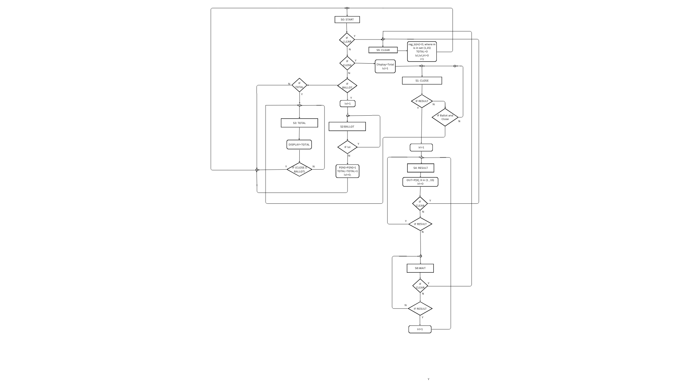

# 🗳️ Electronic Voting Machine (EVM) Control Unit  
### RTL → GDSII Implementation using Open-Source ASIC Flow


---

## 📌 Project Overview

This project presents the **RTL design and ASIC physical implementation** of a **Control Unit for an Electronic Voting Machine (EVM)**.

The objective is to demonstrate a **complete digital VLSI flow**:

The control unit ensures secure and controlled voting operations using a **Finite State Machine (FSM)** architecture.

---

## 🎯 Design Objectives

- Secure voting operation
- Single vote enforcement
- Deterministic state transitions
- Synthesizable RTL design
- Complete open-source ASIC implementation

---

## 🧠 Architecture

The control logic is implemented as a **synchronous FSM**.

### FSM States

### Functional Modules

- ✅ Vote Enable Controller  
- ✅ Candidate Selection Logic  
- ✅ Vote Lock Mechanism  
- ✅ Result Mode Controller  
- ✅ Reset & Initialization Logic  

---
## 🧠 FSM Diagram

<p align="center">
  
</p>
---
## ⭐ Special Features

- 🔐 **Single Vote Protection**
  - Prevents multiple votes per cycle.

- ⚡ **Fully Synchronous RTL**
  - Clock-based deterministic behavior.

- 🧩 **Modular Design**
  - Easily extendable for N candidates.

- 🛠 **Complete RTL-to-GDS Flow**
  - Industry-style ASIC implementation.

- 📉 **Optimized Logic Mapping**
  - Reduced cell utilization.

- 🧪 **Testbench Verified**

---

## 🏗️ RTL → GDSII Flow


---

## ⚙️ Tools & Technologies

| Tool | Role |
|------|------|
| Verilog HDL | RTL Design |
| Yosys | Logic Synthesis |
| ABC | Technology Mapping |
| Qflow | Physical Design Flow |
| Magic VLSI | Layout Viewer |
| Netgen | LVS Verification |
| GTKWave | Waveform Analysis |

---

## 🧮 Yosys Synthesis Results

### Run Command

```bash
yosys -s synthesis/yosys_script.ys
