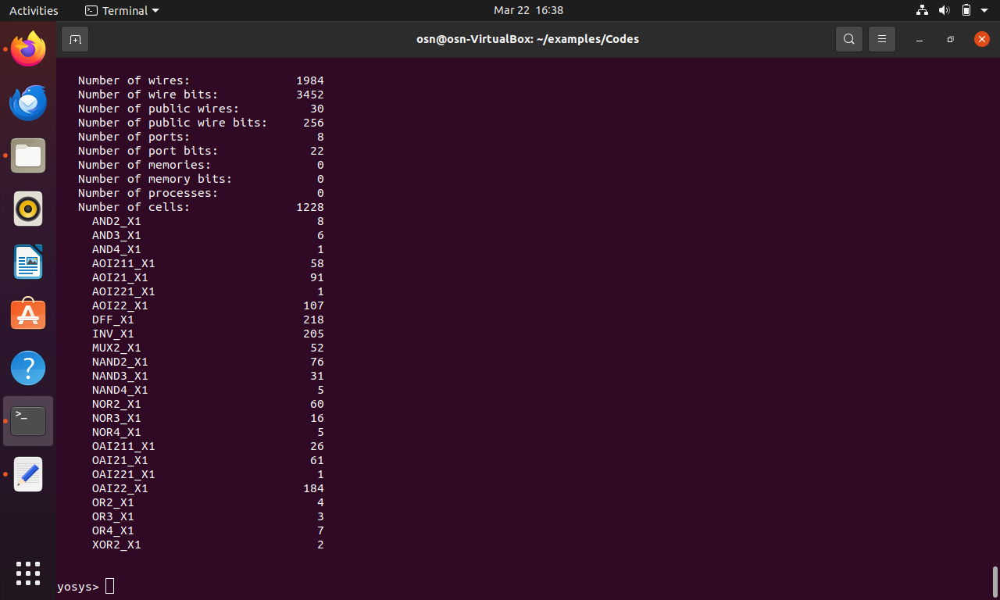
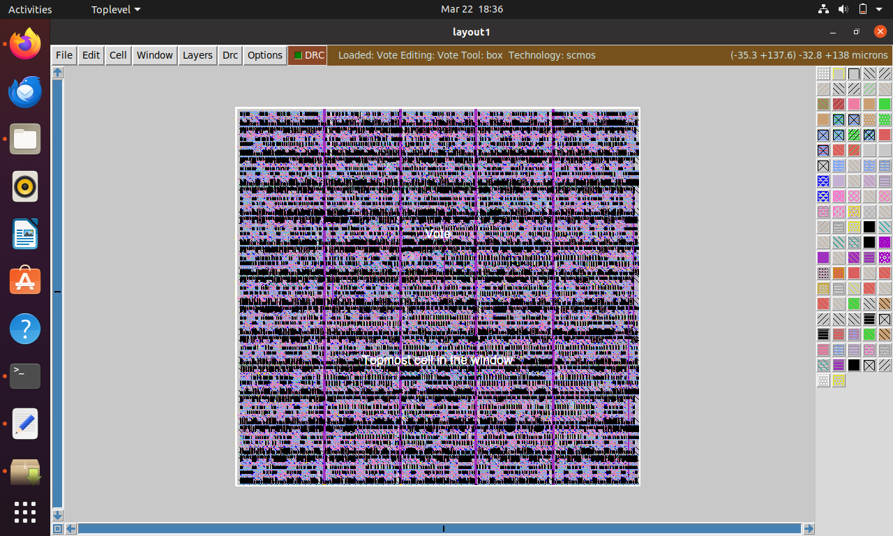
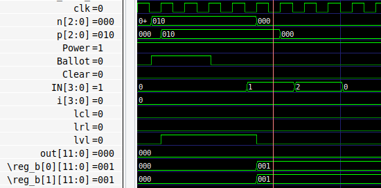
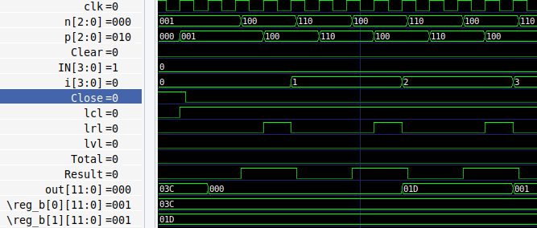

# 🗳️ Electronic Voting Machine (EVM) Control Unit  
### RTL → GDSII Implementation using Open-Source ASIC Flow


---

## 📌 Project Overview

This project presents the **RTL design and ASIC physical implementation** of a **Control Unit for an Electronic Voting Machine (EVM)**.

The objective is to demonstrate a **complete digital VLSI flow**:

The control unit ensures secure and controlled voting operations using a **Finite State Machine (FSM)** architecture.

---

## 🎯 Design Objectives

- Secure voting operation
- Single vote enforcement
- Deterministic state transitions
- Synthesizable RTL design
- Complete open-source ASIC implementation
- Also to provide a new feature of Pressing both the Ballot and Close button to come out of the Close state, so that the machine can be used the next day without restarting it.

---

## 🧠 Architecture

The control logic is implemented as a **synchronous FSM**.

### Functional Modules

- ✅ Vote Enable Controller  
- ✅ Candidate Selection Logic  
- ✅ Vote Lock Mechanism  
- ✅ Result Mode Controller  
- ✅ Reset & Initialization Logic

### Function of Individual States

- START: This state is the starting state of the Control Unit and every time the machine starts
it comes to this state.
- CLEAR: In this state, all memories and reg or levels are cleared.
- CLOSE: In this state, the CU behaves as an off state until the Power button is off or the Result
button is pressed or both the Ballot and the Close button are pressed. And here any button
pressed in the ballot unit will have no effect, also the total vote casted is cleared each time close
is pressed.
- Ballot: In this state, the increment of the particular individual vote is done to whom the partic-
ular is casted, and the total number of votes casted is also incremented.
- TOTAL: In this state, the total number of votes cast is shown.
- RESULT: In this state, the total vote the individual candidate or party has received is shown
one at a time and every time the result button is pressed the next candidates votes are displayed,
in order from 1 to 15 and if the number of time button pressed is increased it starts from the
starting candidate again.
- WAIT: This state is made in order to make the RESULT state works properly, because every
time when another time the result button is pressed, then transition between RESULT and
WAIT happens to increment the variable which shows the respective votes and also to sustain
the previous vote until the next is pressed.

---

## 🧠 Asm Chart

<p align="center">
  
</p>

---

## Function
- Every time the machine needs to start, the Power button must be switched on.
- Whenever a new round of Voting is started the machine should be cleared by pressing the Clear
button.
- Now at the time of Voting, when the agent has verified the Voter and grants the access to vote,
the Ballot button must be pressed.
- In between if there is the need of counting the total number of votes then the Total button must
ne pressed.
- After the voting of the day the machine must be closed and before that the Close button must
be pressed, such that in between no extra vote could be added or cleared.
- And after that the Power button must be turned off.
- At the next turn of the voting phase, the same machine can be used if the total count is than
the limit (which is 4096 here).
- As soon as the positive edge of Power is obtained by switching it on the state goes to starting
state, so it can start.
- Now if the result is needed to observe then there is a set rule, first the Close button should be
pressed followed by the Result button which will give the result. If the machine is in the Close
state then without Result button it can’t come out of that state, except if it gets the positive
edge of the Power button or if the Ballot and Close buttons are pressed at the same time, then
the machine goes to the Total state where it shows the total vote and then it goes to s0 or the
start state. Now, the result button should be pressed every time the vote casted to the next
candidate is needed.
- After getting the votes received by every candidate, on pressing the Result button again starts
from the first candidate.
- Now to come out of the Result state, there is only one way either by positive edge of the Power
or by Clear button, so that it can’t be used any more. And these fixed steps of getting result is
mentioned in the EVM Manuel as mentioned in: [oI18].
- And after completion of the particular task the Power button should be turned off.

---
## ⭐ Special Features

- 🔐 **Single Vote Protection**
  - Prevents multiple votes per cycle.
  
- 🛠 ** Reusable the next day **
   - Generally the machine is not used next day once closed but by this if the limit is not hit, then it can be used next day without restarting it.

- ⚡ **Fully Synchronous RTL**
  - Clock-based deterministic behavior.

- 🧩 **Modular Design**
  - Easily extendable for 15 candidates.

- 🛠 **Complete RTL-to-GDS Flow**
  - Industry-style ASIC implementation.

- 📉 **Optimized Logic Mapping**
  - Reduced cell utilization.

- 🧪 **Testbench Verified**

---

## 🏗️ RTL → GDSII Flow


---

## ⚙️ Tools & Technologies

| Tool | Role |
|------|------|
| Verilog HDL | RTL Design |
| Yosys | Logic Synthesis |
| ABC | Technology Mapping |
| NangateOpenCellLibrary | Standard cell Library |
| Qflow | Physical Design Flow |
| Magic VLSI | Layout Viewer |
| GTKWave | Waveform Analysis |

---
## 🏗️ RTL → GDSII Flow


### Yosys Run Command

```bash
yosys 
read_verilog Vote.v
proc
synth -top Vote
stat
dfflibmap -liberty NangateOpenCellLibrary_typical.lib
abc -liberty NangateOpenCellLibrary_typical.lib
stat
```
### 🧠 Yosys output

<p align="center">
  
</p>

## 🧠 QFlow output

<p align="center">
  
</p>

## 🧠 Testbench Output

<p align="center">
  
</p>
<p align="center">
  
</p>
